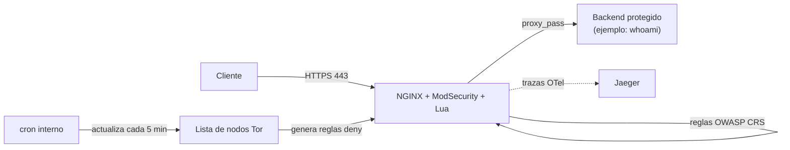

# nginx-waf-lua

Imagen Docker de NGINX con **ModSecurity** (WAF), **OpenTelemetry** y scripting en **Lua** (OpenResty), pensada como material de referencia/entrenamiento: cómo compilar NGINX con módulos dinámicos, blindarlo con un WAF basado en reglas OWASP, instrumentarlo con trazas, y automatizar tareas periódicas (actualización de listas de Tor, rotación de logs) dentro del propio contenedor.

## El problema

Exponer una aplicación directamente a Internet sin una capa intermedia deja a la aplicación como único punto de defensa frente a inyecciones SQL, XSS, escaneos automatizados, bots y tráfico anónimo (Tor). Añadir esa capa normalmente implica renunciar a algo: un WAF gestionado (caro, o atado a un proveedor cloud concreto) o un NGINX "de fábrica" al que le faltan los módulos necesarios (ModSecurity, OpenTelemetry, Lua no vienen compilados en la imagen oficial).

## La solución

Una imagen de NGINX compilada a medida, en dos etapas, que añade:

- **ModSecurity 3** + **OWASP Core Rule Set** — WAF con reglas mantenidas por la comunidad, activables/ajustables por variables de entorno (nivel de paranoia, acciones por fase).
- **OpenTelemetry** — trazas distribuidas del propio NGINX hacia un backend como Jaeger, sin necesidad de un sidecar aparte.
- **Lua (OpenResty) + ngx_devel_kit** — scripting dentro de NGINX para lógica de filtrado (por ejemplo, el filtrado de user-agents de este repo).
- **Bloqueo de nodos de salida de Tor** — un cron actualiza la lista oficial cada 5 minutos y genera reglas `deny` para NGINX.
- **Soporte gRPC** (HTTP/2) — incluido un entorno de pruebas completo con Jaeger y un servidor gRPC de ejemplo.

## Arquitectura



## Puesta en marcha rápida

Requiere Docker y Docker Compose. El primer `docker compose up --build` compila NGINX, ModSecurity y LuaJIT desde fuente (no hay binarios cacheados), así que puede tardar varios minutos y usar bastante CPU la primera vez; builds posteriores reutilizan la caché de capas y son casi instantáneos si no cambian las versiones fijadas en el Dockerfile.

```bash
# 1. Generar certificados TLS autofirmados (solo para desarrollo local)
bash scripts/generar-certificados-dev.sh

# 2. Levantar el WAF delante de un backend de ejemplo ("whoami")
docker compose up --build

# 3. Probar tráfico normal
curl -k https://localhost/            # pasa por el WAF y llega al backend
curl -k https://localhost/healthz     # -> "OK"
curl -k https://localhost/metrics/nginx
```

### Verificar que el WAF realmente bloquea

El paso anterior solo demuestra que el proxy funciona; esto demuestra que ModSecurity + OWASP CRS están inspeccionando y bloqueando tráfico malicioso:

```bash
# SQL injection -> 403 (bloqueado por el WAF, nunca llega al backend)
curl -k -o /dev/null -w "%{http_code}\n" --get https://localhost/ \
  --data-urlencode "id=1' OR '1'='1"

# XSS -> 403
curl -k -o /dev/null -w "%{http_code}\n" --get https://localhost/ \
  --data-urlencode "q=<script>alert(1)</script>"
```

El detalle de qué regla del CRS disparó el bloqueo (mensaje, id de regla, score de anomalía) queda en `docker exec waf-demo-nginx cat /var/log/nginx/modsec_audit.log`.

Para el entorno de pruebas específico de gRPC/OpenTelemetry, mira [`test/README-gRPC.md`](test/README-gRPC.md).

## Configuración por variables de entorno

| Variable | Descripción | Ejemplo |
|---|---|---|
| `ANOMALY_INBOUND` | Umbral de anomalía en tráfico entrante (OWASP CRS) | `5` |
| `ANOMALY_OUTBOUND` | Umbral de anomalía en tráfico saliente (OWASP CRS) | `4` |
| `BLOCKING_PARANOIA` | Nivel de paranoia de las reglas OWASP CRS (1-4) | `1` |

> **Nota:** no hay variables para forzar la acción por defecto de ModSecurity
> por fase (`SecDefaultAction`) porque el OWASP CRS ya fija la suya propia
> (`phase:1/2,log,auditlog,pass`) en `crs-setup.conf`, necesaria para que
> funcione el sistema de scoring de anomalías — ModSecurity no permite dos
> `SecDefaultAction` en la misma fase y aborta el arranque si lo intentas.
> Para ajustar cuándo bloquea el WAF, usa `BLOCKING_PARANOIA` /
> `ANOMALY_INBOUND` / `ANOMALY_OUTBOUND`, no una acción por defecto.

> **Limitación conocida:** estas variables (y la lista de nodos de salida de Tor) se releen cada 5 minutos vía cron, pero el fichero de configuración que generan solo se aplica en el **arranque** de NGINX — no hay recarga en caliente. Para que un cambio de variable de entorno surta efecto, recrea el contenedor (`docker compose up -d` tras editarla) en vez de esperar al cron.

## Estructura del repositorio

```
.
├── Dockerfile                    # build multi-stage: compila NGINX + módulos, y la imagen final
├── docker-compose.yml            # demo rápida (nginx-waf + backend de ejemplo)
├── .github/workflows/build.yml   # CI: build de la imagen + smoke test (WAF bloquea SQLi/XSS)
├── scripts/
│   └── generar-certificados-dev.sh
├── assets/
│   ├── nginx/
│   │   ├── nginx.conf             # configuración principal
│   │   ├── modsecurity.conf       # reglas base de ModSecurity
│   │   ├── docker-entrypoint.sh   # sustituye variables de entorno y arranca cron + nginx
│   │   ├── modsecurity/
│   │   │   ├── activate-rules.sh          # aplica BLOCKING_PARANOIA/ANOMALY_* al arrancar
│   │   │   └── tx-overrides.conf.default  # valores por defecto empaquetados en la imagen
│   │   └── conf/
│   │       ├── default.conf       # server block: TLS, proxy, healthcheck, métricas
│   │       ├── tor.script         # actualiza la lista de nodos de salida de Tor
│   │       ├── useragent.filter   # filtrado de user-agents conocidos de escaneo
│   │       └── unicode.mapping    # tabla de códigos usada por ModSecurity
│   └── cron/                      # tareas periódicas (Tor, activación de reglas, healthcheck)
└── test/                          # entorno de pruebas para gRPC + OpenTelemetry (Jaeger)
```

## Licencia

MIT — ver [LICENSE](LICENSE).
