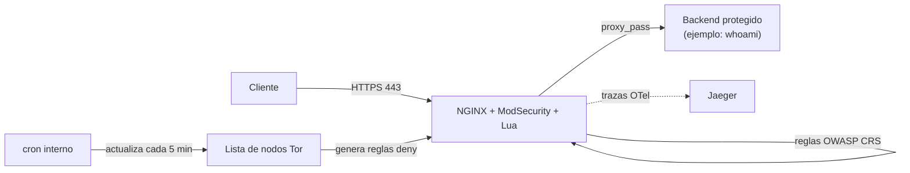

# nginx-waf-lua-demo

Imagen Docker de NGINX con **ModSecurity** (WAF), **OpenTelemetry** y scripting en **Lua** (OpenResty), pensada como material de referencia/entrenamiento: cómo compilar NGINX con módulos dinámicos, blindarlo con un WAF basado en reglas OWASP, instrumentarlo con trazas, y automatizar tareas periódicas (actualización de listas de Tor, rotación de logs) dentro del propio contenedor.

## El problema

Exponer una aplicación directamente a Internet sin una capa intermedia deja a la aplicación como único punto de defensa frente a inyecciones SQL, XSS, escaneos automatizados, bots y tráfico anónimo (Tor). Añadir esa capa normalmente implica renunciar a algo: un WAF gestionado (caro, o atado a un proveedor cloud concreto) o un NGINX "de fábrica" al que le faltan los módulos necesarios (ModSecurity, OpenTelemetry, Lua no vienen compilados en la imagen oficial).

## La solución

Una imagen de NGINX compilada a medida, en dos etapas, que añade:

- **ModSecurity 3** + **OWASP Core Rule Set** — WAF con reglas mantenidas por la comunidad, activables/ajustables por variables de entorno (nivel de paranoia, acciones por fase).
- **OpenTelemetry** — trazas distribuidas del propio NGINX hacia un backend como Jaeger, sin necesidad de un sidecar aparte.
- **Lua (OpenResty) + ngx_devel_kit** — scripting dentro de NGINX para lógica de filtrado (por ejemplo, el filtrado de user-agents de este repo).
- **Bloqueo de nodos de salida de Tor** — un cron actualiza la lista oficial cada 5 minutos y genera reglas `deny` para NGINX.
- **Soporte gRPC** (HTTP/2) — incluido un entorno de pruebas completo con Jaeger y un servidor gRPC de ejemplo.

## Arquitectura



## Puesta en marcha rápida

Requiere Docker y Docker Compose.

```bash
# 1. Generar certificados TLS autofirmados (solo para desarrollo local)
bash scripts/generar-certificados-dev.sh

# 2. Levantar el WAF delante de un backend de ejemplo ("whoami")
docker compose up --build

# 3. Probar
curl -k https://localhost/            # pasa por el WAF y llega al backend
curl -k https://localhost/healthz     # -> "OK"
curl -k https://localhost/metrics/nginx
```

Para el entorno de pruebas específico de gRPC/OpenTelemetry, mira [`test/README-gRPC.md`](test/README-gRPC.md).

## Configuración por variables de entorno

| Variable | Descripción | Ejemplo |
|---|---|---|
| `MODSEC_DEFAULT_PHASE1_ACTION` | Acción del WAF en la fase 1 | `phase:1,log,auditlog,deny,status:403` |
| `MODSEC_DEFAULT_PHASE2_ACTION` | Acción del WAF en la fase 2 | `phase:2,log,auditlog,deny,status:403` |
| `ANOMALY_INBOUND` | Umbral de anomalía en tráfico entrante (OWASP CRS) | `5` |
| `ANOMALY_OUTBOUND` | Umbral de anomalía en tráfico saliente (OWASP CRS) | `4` |
| `BLOCKING_PARANOIA` | Nivel de paranoia de las reglas OWASP CRS (1-4) | `1` |


## Estructura del repositorio

```
.
├── Dockerfile                    # build multi-stage: compila NGINX + módulos, y la imagen final
├── docker-compose.yml            # demo rápida (nginx-waf + backend de ejemplo)
├── scripts/
│   └── generar-certificados-dev.sh
├── assets/
│   ├── nginx/
│   │   ├── nginx.conf             # configuración principal
│   │   ├── modsecurity.conf       # reglas base de ModSecurity
│   │   ├── docker-entrypoint.sh   # sustituye variables de entorno y arranca cron + nginx
│   │   └── conf/
│   │       ├── default.conf       # server block: TLS, proxy, healthcheck, métricas
│   │       ├── tor.script         # actualiza la lista de nodos de salida de Tor
│   │       ├── useragent.filter   # filtrado de user-agents conocidos de escaneo
│   │       └── unicode.mapping    # tabla de códigos usada por ModSecurity
│   └── cron/                      # tareas periódicas (Tor, activación de reglas, healthcheck)
└── test/                          # entorno de pruebas para gRPC + OpenTelemetry (Jaeger)
```

## Ideas para ampliar esta demo

- Sustituir el backend de ejemplo por una aplicación real y medir el efecto del WAF con una herramienta como OWASP ZAP.
- Exportar las métricas de `/metrics/nginx` a Prometheus (hay un exporter de NGINX stub_status listo para eso).
- Empaquetar esta imagen como un chart de Helm para desplegarla en Kubernetes (ver el resto de proyectos de este portfolio).
- Firmar la imagen con `cosign` y añadir un escaneo de vulnerabilidades (Trivy) al pipeline de CI.

## Licencia

MIT — ver [LICENSE](LICENSE).
